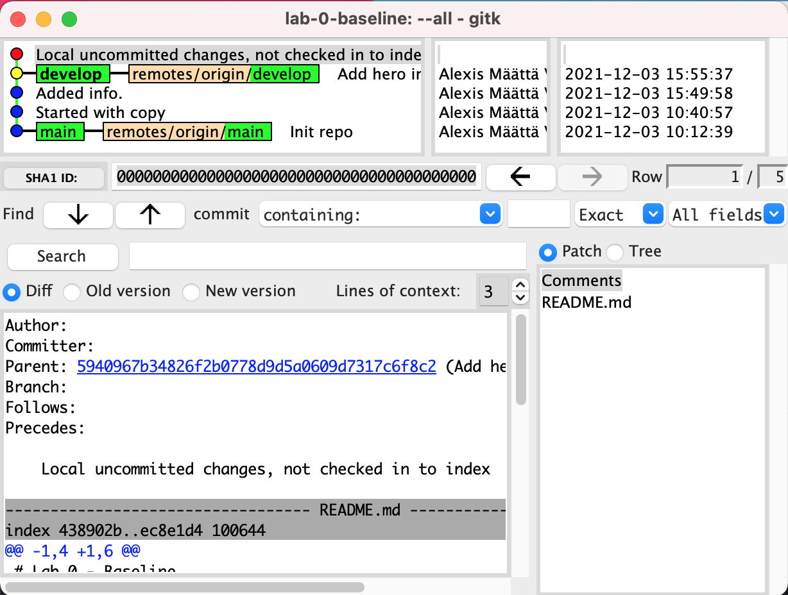
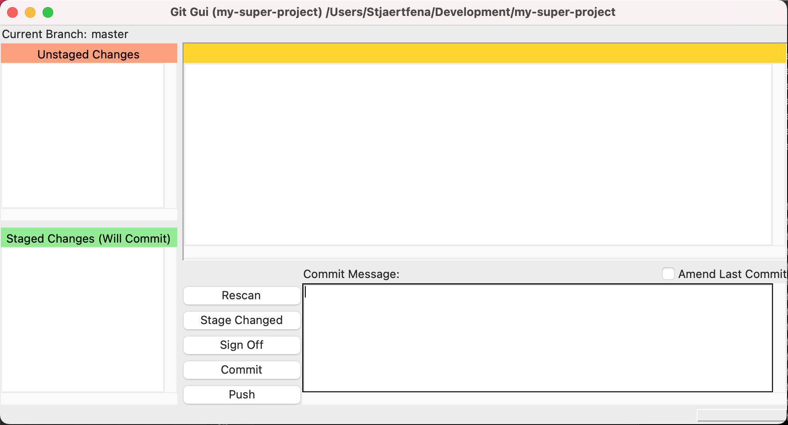

# Assignment 0 - Getting your baseline
As with anything, getting a solid baseline to start off from generally sets you up for success –  the same goes for Git! This assignment is designed to allow you to verify that you have all the tools you need.


Photo by <a href="https://unsplash.com/@carlevarino?utm_source=unsplash&utm_medium=referral&utm_content=creditCopyText">Cesar Carlevarino Aragon</a> on <a href="https://unsplash.com/s/photos/tools?utm_source=unsplash&utm_medium=referral&utm_content=creditCopyText">Unsplash</a>

## Purpose & Goal
- Make sure all relevant Git tools are working on your machine
  - [Git > v2.34.0][1]
  - [gitk](http://git-scm.com/docs/gitk)
  - [git-gui](http://git-scm.com/docs/git-gui)
- Verify auto complete for Git CLI is working
- Verify local Git config is set up
- Have [SSH connectivity][2] with GitHub

## Expectations
- Work on your own machine, but feel free to help each other out!

## The assignment
Prepping your machine with the tools that you need!

### Installing Git (gitk & git-gui)
1. Verify if Git is installed or not, and if you are running the [latest version](https://en.wikipedia.org/wiki/Git#Releases) using:
```
$ git --version
git version 2.34.1
```
If you see above output you are all good and can continue to the next section. Other wise, you first need to install Git by downloading it from [here][1].

1. Follow the installation instructions when installing Git and stick to the predefined defaults. Once done, redo step one to verify everything looks correct.

1. With `git` installed, verify that `gitk` and `git-gui` is also working (they are shipped as part of the Git installation).

  1. Navigate into an existing local repository using the terminal (if you don't have any existing local repo, just initialize a new using `$ git init` from a directory of your choice).

  1. Type: `$ gitk`, if everything is working you should see something like this.
  
  If Gitk does not open, you need to trouble shoot what might be wrong. =)

  1. Now it's time to verify that the final helper program `git-gui` is working. From the same project (repo) you verified `gitk` run `$ git gui`. If everything is working, you should be seeing a window that looks like this:
  
  If Git GUI does not open, you need to trouble shoot what might be wrong. =)

All fundamental programs are now verified, now let's level up by enabling auto complete for Git CLI!

### Configuring CLI auto complete
1. Verify if your Git CLI auto complete is already working by typing `git sw` in your terminal and hit **_tab_** – if everything is working it should automatically complete you command to `git switch`.

1. If this is not the case you need to enable auto complete for your particular system, whether it's `bash`, `zsh`, `Windows Console`, `Windows Powershell`, or `Cygwin`. Google is your best friend here! =)

### Configuring your local Git config
With both Git and auto complete working it's time to make sure you have some basic configuration in place. With Git there are three different places configuration can be set:
- `$(prefix)/etc/gitconfig` (System-wide configuration file)
- `~/.gitconfig` (User specific configuration file, a.k.a "global" config)
- `.git/config` (Repository specific configuration file)

Configuration is read by Git top down, with last value found taking precedence over values read earlier.

In this case we're interested in verifying your "global" config, which is applicable across all Git projects on your machine.

1. Read the configurations already present using:
```
$ git config --list --global
```
1. Make sure the following attributes are set.
```
user.name=Alexis Määttä Vinkler
user.email=alexis@flatwave.se
init.defaultbranch=main
```
If not, set them up accordingly:
```
$ git config --global user.name "Donald Duck"
$ git config --global user.email "donald.duck@duckburg.com"
$ git config --global init.defaultbranch "main"
```
1. Verify through step 1 that all settings now looks as expected.

### Settings up SSH connectivity with GitHub
Finally, when connecting to remote repositories: SSH is the preferred protocol. It allows you to communicate with origin without constantly typing your password.

1. Verify if you already have an SSH connection configured for GitHub by typing the following command:
```
  $ ssh -T git@github.com

  Warning: Permanently added the RSA host key for IP address '140.82.114.3' to the list of known hosts.
  Hi Stjaertfena! You've successfully authenticated, but GitHub does not provide shell access.
```
If you don't manage to authenticate and instead get `Permissioned denied`, follow [this][2] manual for install instructions. Then retry the first step again once done.

---
Congratulations, you have now completed the first assignment and gotten your Git baseline in place! 🎉

[1]: http://git-scm.com/downloads "Git"
[2]: https://docs.github.com/en/authentication/connecting-to-github-with-ssh "SSH"
